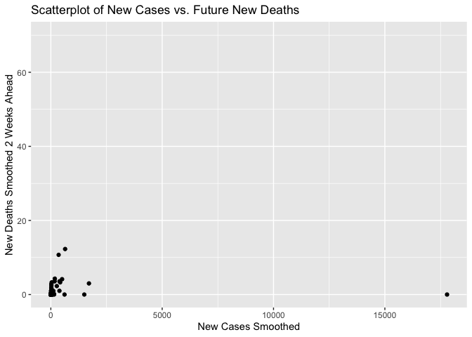
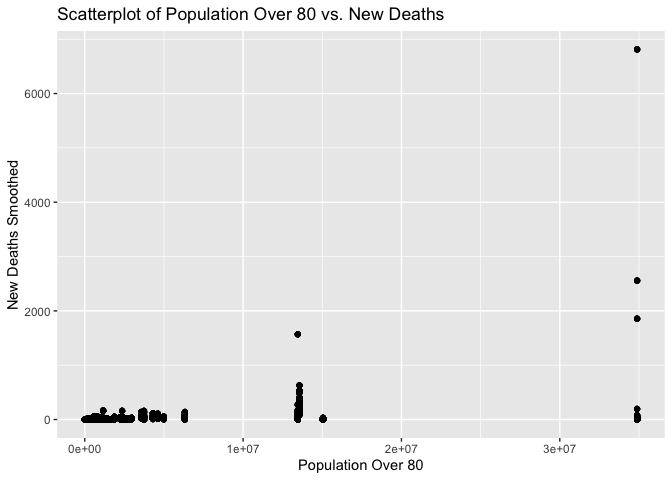

Prediction for Covid  
================
Alex Jun
2024-08-10

``` r
library(dplyr)
```

    ## 
    ## Attaching package: 'dplyr'

    ## The following objects are masked from 'package:stats':
    ## 
    ##     filter, lag

    ## The following objects are masked from 'package:base':
    ## 
    ##     intersect, setdiff, setequal, union

``` r
library(tidyverse)
```

    ## ── Attaching core tidyverse packages ──────────────────────────────────────────────────────────────────────────────────────────────────────────────────────────── tidyverse 2.0.0 ──
    ## ✔ forcats   1.0.0     ✔ readr     2.1.5
    ## ✔ ggplot2   3.5.1     ✔ stringr   1.5.1
    ## ✔ lubridate 1.9.3     ✔ tibble    3.2.1
    ## ✔ purrr     1.0.2     ✔ tidyr     1.3.1

    ## ── Conflicts ────────────────────────────────────────────────────────────────────────────────────────────────────────────────────────────────────────────── tidyverse_conflicts() ──
    ## ✖ dplyr::filter() masks stats::filter()
    ## ✖ dplyr::lag()    masks stats::lag()
    ## ℹ Use the conflicted package (<http://conflicted.r-lib.org/>) to force all conflicts to become errors

``` r
library(kableExtra)
```

    ## 
    ## Attaching package: 'kableExtra'
    ## 
    ## The following object is masked from 'package:dplyr':
    ## 
    ##     group_rows

``` r
library(modelr)
library(ggplot2)

#As I mentioned to professor, I think that training data is not really enough for the 2022. Therefore, I will load the two excel files which are of 2022 and 2023 from databank. 

# Loading the File 
covid <- read.csv("owid-covid-data.csv")
pop_2022 <- readxl::read_excel("population_train.xlsx")
pop_2023 <- readxl::read_excel("population_valid.xlsx")

# iso code which has 3 length
covid <- covid %>%
  filter(nchar(iso_code) == 3)

# having the train and test data which is valid_data. Removing Series name to prevent the multiple rows from future pivot wider.
pop_train<- pop_2022 %>% dplyr::select(-c("Series Name"))
pop_valid<- pop_2023 %>% dplyr::select(-c("Series Name"))

# Do pivot wider to have each country with the variables will be as an column each
pop_valid <- pop_valid %>%
  pivot_wider(names_from = "Series Code", values_from = "2023 [YR2023]")
```

    ## Warning: Values from `2023 [YR2023]` are not uniquely identified; output will contain list-cols.
    ## • Use `values_fn = list` to suppress this warning.
    ## • Use `values_fn = {summary_fun}` to summarise duplicates.
    ## • Use the following dplyr code to identify duplicates.
    ##   {data} |>
    ##   dplyr::summarise(n = dplyr::n(), .by = c(`Country Name`, `Country Code`, `Series Code`)) |>
    ##   dplyr::filter(n > 1L)

``` r
pop_train <- pop_train %>%
  pivot_wider(names_from = "Series Code", values_from = "2022 [YR2022]")
```

    ## Warning: Values from `2022 [YR2022]` are not uniquely identified; output will contain list-cols.
    ## • Use `values_fn = list` to suppress this warning.
    ## • Use `values_fn = {summary_fun}` to summarise duplicates.
    ## • Use the following dplyr code to identify duplicates.
    ##   {data} |>
    ##   dplyr::summarise(n = dplyr::n(), .by = c(`Country Name`, `Country Code`, `Series Code`)) |>
    ##   dplyr::filter(n > 1L)

``` r
# Data cleaning removing some unnecessary rows.
pop_valid<- pop_valid %>% dplyr::select(-c("NA")) %>%
  slice(1:(n() - 3))
pop_train<- pop_train %>% dplyr::select(-c("NA")) %>%
  slice(1:(n() - 3))

# need to numeric to have logical operator
pop_valid <- pop_valid %>%
  mutate(SP.POP.TOTL = as.numeric(as.character(SP.POP.TOTL)))
```

    ## Warning: There was 1 warning in `mutate()`.
    ## ℹ In argument: `SP.POP.TOTL = as.numeric(as.character(SP.POP.TOTL))`.
    ## Caused by warning:
    ## ! NAs introduced by coercion

``` r
pop_train <- pop_train %>%
  mutate(SP.POP.TOTL = as.numeric(as.character(SP.POP.TOTL)))
```

    ## Warning: There was 1 warning in `mutate()`.
    ## ℹ In argument: `SP.POP.TOTL = as.numeric(as.character(SP.POP.TOTL))`.
    ## Caused by warning:
    ## ! NAs introduced by coercion

``` r
# having the population more than 1000000
pop_valid <- pop_valid %>%
  filter(!is.na(SP.POP.TOTL),      
         SP.POP.TOTL >= 1000000)

pop_train <- pop_train %>%
  filter(!is.na(SP.POP.TOTL),     
         SP.POP.TOTL >= 1000000)

# Before join the data spliting the covid file to train and test data
covid_valid <- covid %>% filter(date >= as.Date("2023-01-01"))

covid_train <- covid %>% filter(date >= as.Date("2022-01-01")) %>%
  filter(date < as.Date("2023-01-01"))

# In order to have a prediction use lag function to have a prediction.
covid_valid <- covid_valid %>%
  mutate(date = as.Date(date) - 14,
         new_deaths_smoothed_2wk = new_deaths_smoothed,
         new_deaths_smoothed = lag(new_deaths_smoothed, 14))

covid_train <- covid_train %>%
  mutate(date = as.Date(date) - 14,
         new_deaths_smoothed_2wk = new_deaths_smoothed,
         new_deaths_smoothed = lag(new_deaths_smoothed, 14))

# Keep all data but selecting the important variables
covid_valid <- covid_valid %>%
  select(iso_code, date, new_deaths_smoothed, new_deaths_smoothed_2wk, population, everything())
covid_train <- covid_train %>%
  select(iso_code, date, new_deaths_smoothed, new_deaths_smoothed_2wk, population, everything())

# Doing inner join to have same iso_code and country code
final_valid <- inner_join(covid_valid, pop_valid, by = c("iso_code" = "Country Code"))
final_train <- inner_join(covid_train, pop_train, by = c("iso_code" = "Country Code"))

# Doing some data wriangling for future calulation
final_valid <- final_valid %>%
  mutate(SP.POP.80UP.FE = as.numeric(as.character(SP.POP.80UP.FE)),
         SP.POP.80UP.MA = as.numeric(as.character(SP.POP.80UP.MA)),
         SP.URB.TOTL = as.numeric(as.character(SP.URB.TOTL)),
         SP.POP.TOTL = as.numeric(as.character(SP.POP.TOTL)))

final_train <- final_train %>%
  mutate(SP.POP.80UP.FE = as.numeric(as.character(SP.POP.80UP.FE)),
         SP.POP.80UP.MA = as.numeric(as.character(SP.POP.80UP.MA)),
         SP.URB.TOTL = as.numeric(as.character(SP.URB.TOTL)),
         SP.POP.TOTL = as.numeric(as.character(SP.POP.TOTL)))

# Having Three variables transfrom
final_valid <- final_valid %>%
  mutate(cardiovasc_deaths = cardiovasc_death_rate * population)
final_train <- final_train %>%
  mutate(cardiovasc_deaths = cardiovasc_death_rate * population)

final_valid <- final_valid %>%
  mutate(elderly_population_percentage = ((SP.POP.80UP.FE + SP.POP.80UP.MA) / SP.POP.TOTL) * 100)
final_train <- final_train %>%
  mutate(elderly_population_percentage = ((SP.POP.80UP.FE + SP.POP.80UP.MA) / SP.POP.TOTL) * 100)

final_valid <- final_valid %>%
  mutate(urban_population_percentage = (SP.URB.TOTL / SP.POP.TOTL) * 100)
final_train <- final_train %>%
  mutate(urban_population_percentage = (SP.URB.TOTL / SP.POP.TOTL) * 100)

# January to June 30 of testing data
final_valid <- final_valid %>%
  filter(as.Date("2023-01-01") <= date & date <= as.Date("2023-06-30"))

# just checking the NA values from testing data to exclude the predictors who have lots of NA values. 
na_counts <- sapply(final_valid, function(x) sum(is.na(x)))
print(na_counts)
```

    ##                                   iso_code                                       date                        new_deaths_smoothed                    new_deaths_smoothed_2wk 
    ##                                          0                                          0                                        183                                        206 
    ##                                 population                                  continent                                   location                                total_cases 
    ##                                          0                                          0                                          0                                        543 
    ##                                  new_cases                         new_cases_smoothed                               total_deaths                                 new_deaths 
    ##                                        260                                        260                                        543                                        206 
    ##                    total_cases_per_million                      new_cases_per_million             new_cases_smoothed_per_million                   total_deaths_per_million 
    ##                                        543                                        260                                        260                                        543 
    ##                     new_deaths_per_million            new_deaths_smoothed_per_million                          reproduction_rate                               icu_patients 
    ##                                        206                                        206                                      28779                                      25638 
    ##                   icu_patients_per_million                              hosp_patients                  hosp_patients_per_million                      weekly_icu_admissions 
    ##                                      25638                                      25602                                      25602                                      27398 
    ##          weekly_icu_admissions_per_million                     weekly_hosp_admissions         weekly_hosp_admissions_per_million                                total_tests 
    ##                                      27398                                      26788                                      26788                                      28779 
    ##                                  new_tests                   total_tests_per_thousand                     new_tests_per_thousand                         new_tests_smoothed 
    ##                                      28779                                      28779                                      28779                                      28779 
    ##            new_tests_smoothed_per_thousand                              positive_rate                             tests_per_case                                tests_units 
    ##                                      28779                                      28779                                      28779                                          0 
    ##                         total_vaccinations                          people_vaccinated                    people_fully_vaccinated                             total_boosters 
    ##                                      24049                                      24299                                      24296                                      24600 
    ##                           new_vaccinations                  new_vaccinations_smoothed             total_vaccinations_per_hundred              people_vaccinated_per_hundred 
    ##                                      25173                                      10683                                      24049                                      24299 
    ##        people_fully_vaccinated_per_hundred                 total_boosters_per_hundred      new_vaccinations_smoothed_per_million             new_people_vaccinated_smoothed 
    ##                                      24296                                      24600                                      10683                                      11119 
    ## new_people_vaccinated_smoothed_per_hundred                           stringency_index                         population_density                                 median_age 
    ##                                      11119                                      28779                                        362                                          0 
    ##                              aged_65_older                              aged_70_older                             gdp_per_capita                            extreme_poverty 
    ##                                        181                                        181                                        724                                       8688 
    ##                      cardiovasc_death_rate                        diabetes_prevalence                             female_smokers                               male_smokers 
    ##                                        181                                        181                                       5973                                       6335 
    ##                     handwashing_facilities                 hospital_beds_per_thousand                            life_expectancy                    human_development_index 
    ##                                      13756                                       3258                                          0                                        543 
    ##       excess_mortality_cumulative_absolute                excess_mortality_cumulative                           excess_mortality    excess_mortality_cumulative_per_million 
    ##                                      27598                                      27598                                      27598                                      27598 
    ##                               Country Name                                SP.URB.TOTL                                SP.POP.TOTL                          SP.POP.TOTL.MA.IN 
    ##                                          0                                          0                                          0                                          0 
    ##                          SP.POP.TOTL.FE.IN                             SP.POP.80UP.FE                             SP.POP.80UP.MA                          cardiovasc_deaths 
    ##                                          0                                          0                                          0                                        181 
    ##              elderly_population_percentage                urban_population_percentage 
    ##                                          0                                          0

``` r
# Comprehensive Model
model_1 <- lm(new_deaths_smoothed_2wk ~ new_cases_smoothed + total_cases + icu_patients + total_vaccinations + people_fully_vaccinated + gdp_per_capita + urban_population_percentage + life_expectancy + elderly_population_percentage, data = final_train)
summary(model_1)
```

    ## 
    ## Call:
    ## lm(formula = new_deaths_smoothed_2wk ~ new_cases_smoothed + total_cases + 
    ##     icu_patients + total_vaccinations + people_fully_vaccinated + 
    ##     gdp_per_capita + urban_population_percentage + life_expectancy + 
    ##     elderly_population_percentage, data = final_train)
    ## 
    ## Residuals:
    ##     Min      1Q  Median      3Q     Max 
    ## -969.74  -25.97   -5.53   14.87 1630.83 
    ## 
    ## Coefficients:
    ##                                 Estimate Std. Error t value Pr(>|t|)    
    ## (Intercept)                   -3.182e+02  4.551e+01  -6.993 3.00e-12 ***
    ## new_cases_smoothed            -2.649e-04  4.032e-05  -6.570 5.45e-11 ***
    ## total_cases                    3.177e-07  2.890e-07   1.099   0.2717    
    ## icu_patients                   8.779e-02  1.452e-03  60.443  < 2e-16 ***
    ## total_vaccinations            -3.043e-06  2.055e-07 -14.804  < 2e-16 ***
    ## people_fully_vaccinated        9.316e-06  5.391e-07  17.280  < 2e-16 ***
    ## gdp_per_capita                -1.028e-03  2.419e-04  -4.248 2.19e-05 ***
    ## urban_population_percentage   -4.115e-01  1.861e-01  -2.211   0.0271 *  
    ## life_expectancy                4.831e+00  6.840e-01   7.062 1.83e-12 ***
    ## elderly_population_percentage -1.214e-01  1.120e+00  -0.108   0.9137    
    ## ---
    ## Signif. codes:  0 '***' 0.001 '**' 0.01 '*' 0.05 '.' 0.1 ' ' 1
    ## 
    ## Residual standard error: 119.3 on 5876 degrees of freedom
    ##   (52149 observations deleted due to missingness)
    ## Multiple R-squared:  0.7793, Adjusted R-squared:  0.779 
    ## F-statistic:  2305 on 9 and 5876 DF,  p-value: < 2.2e-16

``` r
# Social Economic Model
model_2 <- lm(new_deaths_smoothed_2wk ~ gdp_per_capita + extreme_poverty + population_density + urban_population_percentage + human_development_index, data = final_train)
summary(model_2)
```

    ## 
    ## Call:
    ## lm(formula = new_deaths_smoothed_2wk ~ gdp_per_capita + extreme_poverty + 
    ##     population_density + urban_population_percentage + human_development_index, 
    ##     data = final_train)
    ## 
    ## Residuals:
    ##     Min      1Q  Median      3Q     Max 
    ## -128.66  -25.27   -7.85    0.41 2556.15 
    ## 
    ## Coefficients:
    ##                               Estimate Std. Error t value Pr(>|t|)    
    ## (Intercept)                  1.901e+01  6.844e+00   2.778  0.00547 ** 
    ## gdp_per_capita               2.251e-03  7.915e-05  28.433  < 2e-16 ***
    ## extreme_poverty             -9.350e-03  4.681e-02  -0.200  0.84167    
    ## population_density           4.317e-05  3.267e-03   0.013  0.98946    
    ## urban_population_percentage  3.116e-01  3.888e-02   8.015 1.13e-15 ***
    ## human_development_index     -6.288e+01  1.050e+01  -5.987 2.15e-09 ***
    ## ---
    ## Signif. codes:  0 '***' 0.001 '**' 0.01 '*' 0.05 '.' 0.1 ' ' 1
    ## 
    ## Residual standard error: 111.8 on 40507 degrees of freedom
    ##   (17522 observations deleted due to missingness)
    ## Multiple R-squared:  0.06417,    Adjusted R-squared:  0.06406 
    ## F-statistic: 555.5 on 5 and 40507 DF,  p-value: < 2.2e-16

``` r
# Vaccination related Model
model_3 <- lm(new_deaths_smoothed_2wk ~ total_vaccinations + people_vaccinated + people_fully_vaccinated + total_boosters + new_vaccinations_smoothed, data = final_train)
summary(model_3)
```

    ## 
    ## Call:
    ## lm(formula = new_deaths_smoothed_2wk ~ total_vaccinations + people_vaccinated + 
    ##     people_fully_vaccinated + total_boosters + new_vaccinations_smoothed, 
    ##     data = final_train)
    ## 
    ## Residuals:
    ##     Min      1Q  Median      3Q     Max 
    ## -916.66  -29.43  -12.40   -0.30 2272.84 
    ## 
    ## Coefficients:
    ##                             Estimate Std. Error t value Pr(>|t|)    
    ## (Intercept)                1.011e+01  1.414e+00   7.153 8.90e-13 ***
    ## total_vaccinations        -1.182e-05  3.176e-07 -37.220  < 2e-16 ***
    ## people_vaccinated          1.761e-05  3.364e-07  52.339  < 2e-16 ***
    ## people_fully_vaccinated    5.084e-06  4.099e-07  12.404  < 2e-16 ***
    ## total_boosters             1.430e-05  3.271e-07  43.710  < 2e-16 ***
    ## new_vaccinations_smoothed  3.667e-05  5.167e-06   7.097 1.33e-12 ***
    ## ---
    ## Signif. codes:  0 '***' 0.001 '**' 0.01 '*' 0.05 '.' 0.1 ' ' 1
    ## 
    ## Residual standard error: 151.2 on 15347 degrees of freedom
    ##   (42682 observations deleted due to missingness)
    ## Multiple R-squared:  0.261,  Adjusted R-squared:  0.2608 
    ## F-statistic:  1084 on 5 and 15347 DF,  p-value: < 2.2e-16

``` r
#Health Infrastructure model
model_4 <- lm(new_deaths_smoothed_2wk ~ population + hospital_beds_per_thousand + icu_patients + hosp_patients + handwashing_facilities, data = final_train)
summary(model_4)
```

    ## 
    ## Call:
    ## lm(formula = new_deaths_smoothed_2wk ~ population + hospital_beds_per_thousand + 
    ##     icu_patients + hosp_patients + handwashing_facilities, data = final_train)
    ## 
    ## Residuals:
    ##      Min       1Q   Median       3Q      Max 
    ## -101.243   -5.039   -1.462    1.348  175.696 
    ## 
    ## Coefficients: (1 not defined because of singularities)
    ##                              Estimate Std. Error t value Pr(>|t|)    
    ## (Intercept)                 2.695e+00  2.183e+00   1.235 0.217187    
    ## population                 -2.221e-07  6.933e-08  -3.203 0.001409 ** 
    ## hospital_beds_per_thousand -1.944e-01  5.009e-01  -0.388 0.698135    
    ## icu_patients                1.066e-01  2.922e-02   3.647 0.000281 ***
    ## hosp_patients               1.007e-02  1.950e-03   5.166 2.97e-07 ***
    ## handwashing_facilities             NA         NA      NA       NA    
    ## ---
    ## Signif. codes:  0 '***' 0.001 '**' 0.01 '*' 0.05 '.' 0.1 ' ' 1
    ## 
    ## Residual standard error: 23.93 on 853 degrees of freedom
    ##   (57177 observations deleted due to missingness)
    ## Multiple R-squared:  0.5856, Adjusted R-squared:  0.5837 
    ## F-statistic: 301.4 on 4 and 853 DF,  p-value: < 2.2e-16

``` r
rmse_1 <- rmse(model = model_1, data = final_valid)
rmse_2 <- rmse(model = model_2, data = final_valid)
rmse_3 <- rmse(model = model_3, data = final_valid)
rmse_4 <- rmse(model = model_4, data = final_valid)

cat("Overall RMSE of model 1:", rmse_1, "\n")
```

    ## Overall RMSE of model 1: 41.98729

``` r
cat("Overall RMSE of model 2:", rmse_2, "\n")
```

    ## Overall RMSE of model 2: 132.9378

``` r
cat("Overall RMSE of model 3:", rmse_3, "\n")
```

    ## Overall RMSE of model 3: 154.7397

``` r
cat("Overall RMSE of model 4:", rmse_4, "\n")
```

    ## Overall RMSE of model 4: 39.0372

``` r
# Having RMSE of testing data from Model 1 which I think it is the best model.
country_rmse <- final_valid %>%
  group_by(iso_code) %>%
  summarise(location = first(location),
            population = first(population),
            RMSE = rmse(model= model_1, data=cur_data())
  ) %>% 
  arrange(RMSE)
```

    ## Warning: There was 1 warning in `summarise()`.
    ## ℹ In argument: `RMSE = rmse(model = model_1, data = cur_data())`.
    ## ℹ In group 1: `iso_code = "AFG"`.
    ## Caused by warning:
    ## ! `cur_data()` was deprecated in dplyr 1.1.0.
    ## ℹ Please use `pick()` instead.

``` r
print(country_rmse)

# preparing the data to grouping by iso_code
plot_1 <- final_valid %>%
  group_by(iso_code) %>%
  summarise(
    new_deaths_smoothed_2wk = last(new_deaths_smoothed_2wk), 
    new_cases_smoothed = last(new_cases_smoothed)
  )

# Plot the new_cases_smoothed, new_deaths_smoothed_2wk
ggplot(plot_1, aes(x = new_cases_smoothed, y = new_deaths_smoothed_2wk)) +
  geom_point() +
  labs(title = "Scatterplot of New Cases vs. Future New Deaths",
       x = "New Cases Smoothed",
       y = "New Deaths Smoothed 2 Weeks Ahead")
```

    ## Warning: Removed 5 rows containing missing values or values outside the scale range (`geom_point()`).

<!-- -->

``` r
# preparing the data to grouping by iso_code
plot_2 <- final_valid %>%
  group_by(iso_code) %>%
  summarise(
    new_deaths_smoothed = last(new_deaths_smoothed),
    total_population_over_80 = last(SP.POP.80UP.FE + SP.POP.80UP.MA)
  )

# Plot the total more than 80s, new_deaths_smoothed
ggplot(final_valid, aes(x = (SP.POP.80UP.FE + SP.POP.80UP.MA), y = new_deaths_smoothed)) +
  geom_point() +
  labs(title = "Scatterplot of Population Over 80 vs. New Deaths",
       x = "Population Over 80",
       y = "New Deaths Smoothed")
```

    ## Warning: Removed 183 rows containing missing values or values outside the scale range (`geom_point()`).

<!-- -->

``` r
# Having all 4 RMSE and R^2
data.frame(Model = c("Model 1", "Model 2", "Model 3", "Model 4"),
           RMSE = c(rmse_1, rmse_2, rmse_3, rmse_4),
           R2 = c(summary(model_1)$r.squared, summary(model_2)$r.squared,
                  summary(model_3)$r.squared, summary(model_4)$r.squared))

# Top 20 country
top_20_countries_by_population <- country_rmse %>%
  arrange(desc(population)) %>%
  slice_head(n = 20)  

print(top_20_countries_by_population)
```
